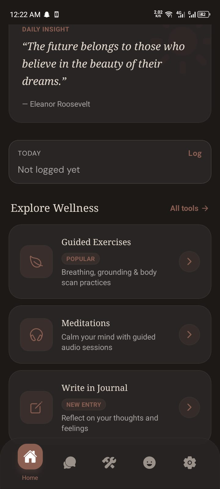
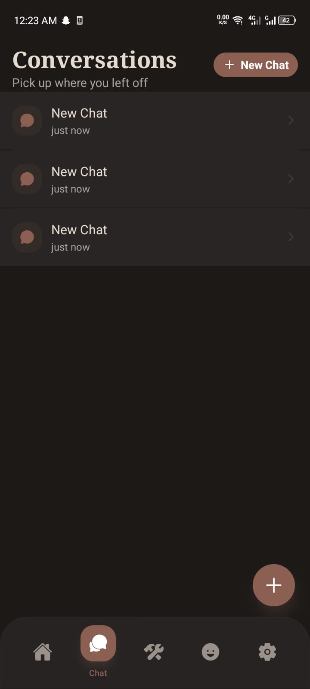
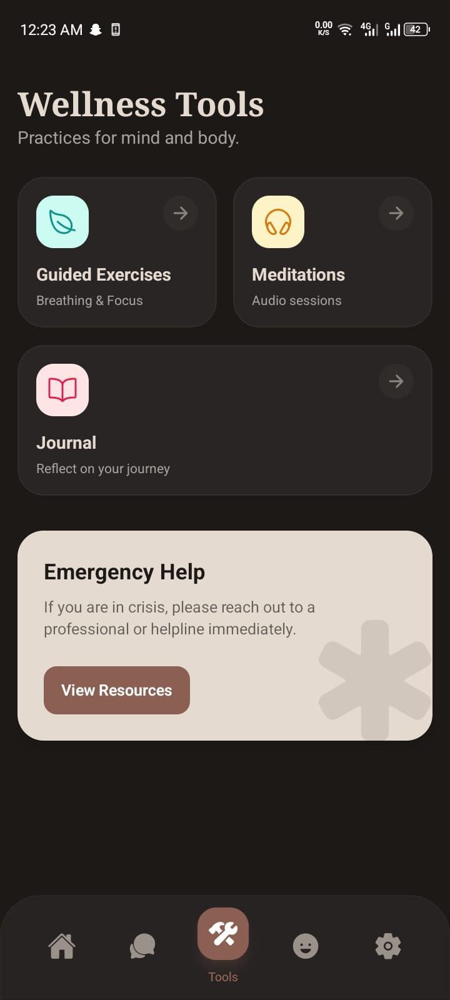
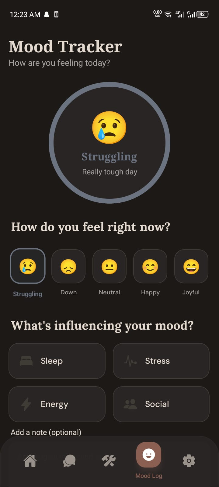
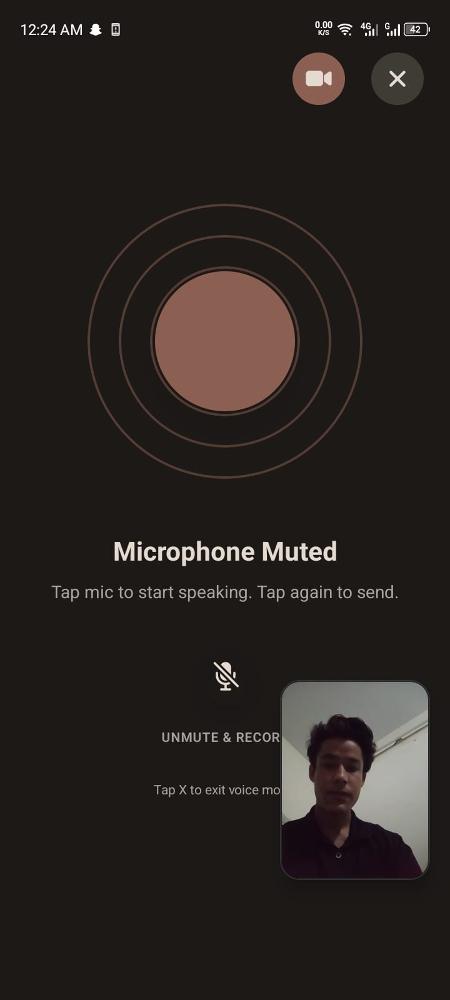
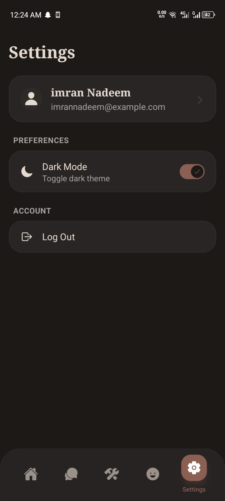

# 🧠 MentiMotive
### Mental Health & Motivational AI Companion

**A Multimodal AI-Powered Emotion Detection and Mental Health Support System**

---

## 🎥 Watch the Demo

## ▶️ [**CLICK HERE TO WATCH THE FULL DEMO VIDEO**](https://youtube.com/shorts/yoo03CWfHao) 🎬

*See text, voice, and facial emotion detection working live, plus the built-in crisis-safety system in action.*

---

> ⚠️ **Note:** This is a showcase repository. Full source code is kept private under an industry–academia agreement with **Funsol Technologies Pvt. Ltd.** and **NUTECH**. This repo documents the project's architecture, features, and demo for portfolio purposes.

---

## 📋 Project Information

| | |
|---|---|
| **Institution** | National University of Technology (NUTECH), Islamabad, Pakistan |
| **Department** | Computer Science |
| **Degree** | Bachelor of Science in Computer Science |
| **Session** | 2022–2026 |
| **Supervisor** | Dr. Mussadiq Abdul Rahim |

**Team Members**
- Imran Nadeem (F22605030)
- Attique Ur Rehman (F22605027)
- Israr Qayyum (F22605004)
- Mehdi Ali (F22605005)

---

## 🎯 Overview

MentiMotive is an intelligent mental health companion that goes beyond a typical chatbot — it *sees, hears, and reads* how a user is really feeling. By fusing **text, voice, and facial emotion signals** into a single real-time pipeline, it builds a genuine understanding of the user's emotional state and responds with empathy, context, and continuity across conversations.

Powered by **Retrieval-Augmented Generation (RAG)**, it grounds its responses in real mental health knowledge rather than generic chatbot replies — and includes a **crisis-safety layer** that automatically detects self-harm or suicide-risk language and redirects the user to real helpline resources instead of a normal AI response.

Built as a **Final Year Project (FYP)** through an industry–academia collaboration between NUTECH and Funsol Technologies.

---

## 🚀 Key Features

| Feature | Description |
|---|---|
| 📝 **Text Emotion Analysis** | Detects sentiment from written messages using **DistilBERT** |
| 🎤 **Voice Emotion Analysis** | Detects emotion from tone of voice using **Wav2Vec2**, with speech-to-text via **Whisper** |
| 🎥 **Facial Emotion Detection** | Real-time camera-based emotion recognition using **Google ML Kit** |
| 💬 **Context-Aware Conversational AI** | Multi-turn, memory-aware chat powered by **LangChain** + OpenAI/Gemini |
| 📚 **RAG-Powered Responses** | Retrieves relevant mental health knowledge from a vector database (**ChromaDB**) to reduce hallucination |
| 🆘 **Crisis Detection & Safety Layer** | Automatically identifies self-harm/suicide risk language and returns verified helpline resources instead of a generated reply |
| 🗣️ **Natural Voice Responses** | Replies in a natural spoken voice via **Edge TTS / TinyTTS** |
| 😊 **Mood Tracker** | Daily mood check-ins with contributing factors (sleep, stress, energy, social life) |
| 🧘 **Wellness Tools** | Guided breathing/grounding exercises, meditations, and a personal journal |
| 👤 **Multi-User Support** | Secure, JWT-authenticated accounts |
| 💾 **Persistent Sessions** | Conversation history saved via **PostgreSQL** |
| ⚡ **Parallel Processing** | Optimized pipeline runs multiple emotion-detection models simultaneously for fast responses |

---

## 📱 App Walkthrough

### 🏠 Home — Daily Insight & Wellness Hub
Daily motivational insight, quick mood logging, and shortcuts to wellness tools.

### 💬 Conversations — Context-Aware Chat
Pick up right where you left off — full conversation history saved per user.

### 🧰 Wellness Tools
Guided exercises, meditations, journaling, and one-tap access to emergency help resources.

### 📊 Mood Tracker
Log how you're feeling daily and what's influencing your mood — sleep, stress, energy, or social life.

### 🎙️ Voice Mode — Real-Time Voice Interaction
Speak naturally — the app transcribes, detects emotion from both your words and your tone, and replies with a natural voice.

### ⚙️ Settings
Manage your profile, theme, and account.

---

## 🏗️ Architecture

### Backend (FastAPI)
- **FastAPI** — asynchronous REST API
- **SQLAlchemy + PostgreSQL** — data persistence
- **LangChain** — conversational AI orchestration
- **ChromaDB** — vector storage for RAG
- **JWT Authentication** — secure multi-user access

### AI Models
| Task | Model |
|---|---|
| Speech-to-Text | Faster Whisper (tiny.en) |
| Text Emotion | DistilBERT (`bhadresh-savani/distilbert-base-uncased-emotion`) |
| Voice Emotion | Wav2Vec2 (`superb/wav2vec2-base-superb-er`) |
| Embeddings | all-MiniLM-L6-v2 (ONNX optimized) |
| LLM | GPT-4o-mini / Gemini 2.5 Flash |
| Text-to-Speech | Microsoft Edge TTS / TinyTTS |

### Mobile App (React Native)
- **Expo (React Native) + TypeScript**
- **Redux Toolkit & Zustand** — state management
- **TailwindCSS / NativeWind** — styling
- **React Native Vision Camera + ML Kit** — real-time facial emotion detection

---

## 📡 Key API Endpoints
